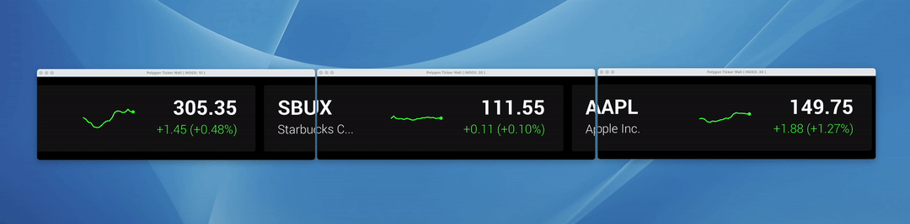
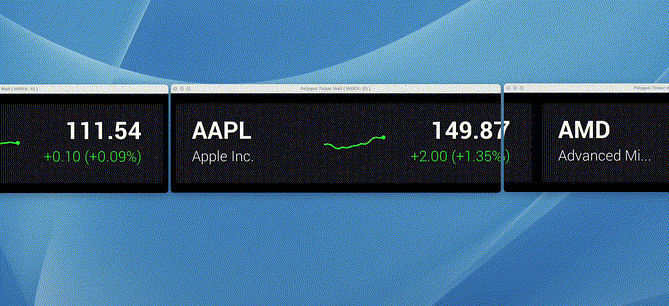

<p align="center">
  
</p>

# Polygon.io - Ticker Wall

The Polygon.io ticker wall is an open source, cross platform, scalable ticker tape. It is meant to be scalable across many machines to eliminate the need for expensive specialty hardware for achieving a scrolling ticker tape. It is cross platform compatible, so it runs on mac, windows or linux ( only mac and linux tested ). All interaction is done via the CLI. There is a gRPC interface for more advanced integrations.

We use it at the [Polygon.io](https://polygon.io) office, but we also wanted it to be general enough to suite a broad group of needs, so most interactions and settings are configurable.

# Getting Started

There are 2 components to a ticker wall cluster. There is 1x Leader and N number of GUIs. The leader can also be run on the same system as a GUI, and there is no minimum for the number of GUIs. You can start with 1 screen, then continue to add more and it will dynamically adjust in real-time.

Download the latest release binary from the [Releases Page](https://github.com/polygon-io/go-app-ticker-wall/releases)

**Start the Leader**

We must start the leader so that the GUIs can connect and get their data to display.

`./tickerwall server -a {myPolygonApiKey}`

**Run the GUI**

`./tickerwall gui`

**To run a second GUI**

`./tickerwall gui --index=2`

# Configuration

Configuration of the applications are achieved via cli flags > env variables > configuration file. The application will search for a configuration file with the name of 'tickerwall' which can be in .yml, .json or .toml format. Environment variables overwrite config file settings, and command line flags overwrite env variables.

# Updating settings

You can use the cli to update attributes of the cluster in real-time. Here are some examples:

Updating the scroll speed:

      ./tickerwall update --scroll-speed=5

Updating the background color to white:

      ./tickerwall update --bg-color=255,255,255,255

# Making Announcements

<p align="center">
  
</p>

You can make announcements using the ticker wall using the following command:

      ./tickerwall announce "Big Announcement!"

You can change the color and animations:

      ./tickerwall announce "Big Success!" --animation=ease --type=success

# Describe a Cluster

You can describe a running cluster using the following:

      ./tickerwall describe

Which should generate output that is similar to:

```
Global Viewport Size: 5760 px
Animation Duration: 500 ms
Scroll Speed: 5
Ticker Box Width: 1100 px
Per Tick Updates: true
Screen Count: 3
Screen Details:
 ------------
 Screen ID: 73452516-62af-4720-be0a-b2d3f6bfc575
 - Width 1920 px
 - Height 300 px
 - Index 10
 ------------
 Screen ID: fd98cf41-c59d-46e5-8c12-832612912674
 - Width 1920 px
 - Height 300 px
 - Index 20
 ------------
 Screen ID: 5aac2e7a-23ef-4ba2-950a-58d434c42dfe
 - Width 1920 px
 - Height 300 px
 - Index 30
 ------------
Ticker count: 6
Tickers:
 -  AAPL  [  Apple Inc.  ]
 -  AMD  [  Advanced Micro Devices  ]
 -  NVDA  [  Nvidia Corp  ]
 -  SBUX  [  Starbucks Corp  ]
 -  FB  [  Meta Platforms, Inc. Class A Common Stock  ]
 -  HOOD  [  Robinhood Markets, Inc. Class A Common Stock  ]
```

# Building from Source Prerequisites

### Linux

On linux, the application requires X11. So you will need: `libgl1-mesa-dev` and `xorg-dev` packages.

### Mac

No additional packages are required for Mac.

### Windows

Not sure, haven't been able to test it.

# TODO / Wish List

These are not in order of priority.

- Run inside docker container.
- Some kind of build process. tests?

- v2.0 - Instead of 2 separate roles ( Server and GUI(s)), use raft to establish the leader amongst GUIs.
