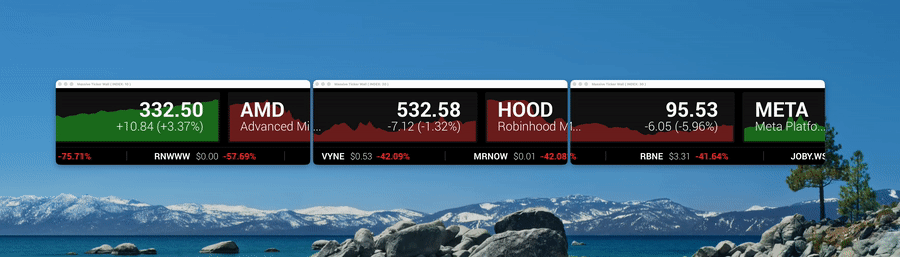
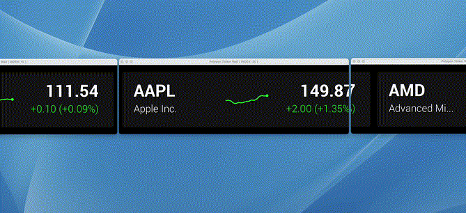

<p align="center">
  
</p>

# Massive.com — Ticker Wall

The Massive.com ticker wall is an open source, cross-platform, horizontally
scalable scrolling stock ticker tape. It spans any number of side-by-side
displays (on one machine or many) to form a single continuous tape, so you can
build a large ticker wall out of commodity screens instead of specialty hardware.
It runs on macOS and Linux. All interaction is via the CLI, with a gRPC interface
underneath for advanced integrations.

We use it at the [Massive.com](https://massive.com) office, and it's configurable
enough to suit a broad range of setups.

This is a **Rust** application (a Cargo workspace under `crates/`). It replaces the
original Go implementation; see [`docs/ARCHITECTURE.md`](docs/ARCHITECTURE.md) for
the design and [`docs/legacy/ARCHITECTURE.md`](docs/legacy/ARCHITECTURE.md) for the
retired Go version.

## Features

- One shared, continuous scrolling tape across N screens, updating live.
- Full-bleed intraday price graph behind every ticker (green/red by direction).
- A second **top gainers/losers** tape pinned to the bottom, on its own speed.
- Full-screen **announcements** with eased slide-in/out animations.
- Live control of colors, speeds, and layout over gRPC — no restart needed.
- Optional on-screen **FPS meter** for performance checks.

## Getting Started

There are two roles in a cluster: **1 leader** and **N GUIs**. The leader can run
on the same machine as a GUI, and there's no minimum number of GUIs — start with
one screen and add more; the tape re-layouts in real time.

Download the latest binary from the
[Releases page](https://github.com/massive-com/ticker-wall/releases), or
build from source (below).

**Start the leader** (pulls data, serves gRPC on `:6886`):

```
tickerwall server -a <MASSIVE_API_KEY>      # or set TW_API_KEY
```

**Run a GUI** (each is one screen/window):

```
tickerwall gui --screen-index 10
tickerwall gui --screen-index 20            # a second screen, to its right
```

## Configuration

Configuration resolves as **CLI flags > environment variables > built-in
defaults**. Environment variables are the flag name uppercased with a `TW_`
prefix — e.g. `--api-key` → `TW_API_KEY`, `--scroll-speed` → `TW_SCROLL_SPEED`,
`--ticker-box-width` → `TW_TICKER_BOX_WIDTH`.

Run `tickerwall <subcommand> --help` for the full flag list.

## Updating settings

Update cluster attributes in real time (only the flags you pass change):

```
tickerwall update --scroll-speed 5
tickerwall update --bg-color 255,255,255,255
tickerwall update --movers-scroll-speed 8        # the bottom tape's own speed
tickerwall update --show-fps true                # toggle the FPS meter
```

## Making announcements

<p align="center">
  
</p>

```
tickerwall announce "Big Announcement!"
tickerwall announce "Big Success!" --animation ease --type success
```

## Describe a cluster

```
tickerwall describe
```

Prints the current settings, connected screens, tickers, and top movers.

## Building from source

```
cargo build --release        # produces target/release/tickerwall
```

`protoc` is **not** required — the protobuf compiler is vendored via
`protoc-bin-vendored` and used automatically at build time.

**Linux** needs X11 + OpenGL dev headers for the GUI:

```
# Debian/Ubuntu
sudo apt-get install -y libgl1-mesa-dev xorg-dev
```

**macOS** needs no extra packages. Windows is untested.

## Development

A `justfile` provides shortcuts (`brew install just`):

```
just build      # cargo build
just test       # cargo test --workspace
just lint       # cargo fmt --check + clippy -D warnings
just server     # run the leader (needs TW_API_KEY)
just gui        # run one GUI screen
just run        # leader + two GUI screens
```

CI (GitHub Actions) builds, tests, lints (fmt + clippy) on Linux and macOS, and
publishes release binaries for `x86_64-unknown-linux-gnu` and
`aarch64-apple-darwin` on version tags (`v*`).

## Deployment

The deployed screens boot straight into the GUI fullscreen with no window manager
(bare X). See [`docs/ARCHITECTURE.md`](docs/ARCHITECTURE.md) for the kiosk setup.

## TODO / Wish list

- Config-file layer (`tickerwall.{yml,json,toml}`) — currently flags + env only.
- Run inside a Docker container.
- v2.0 — replace the explicit leader with Raft-based election among the GUIs.
